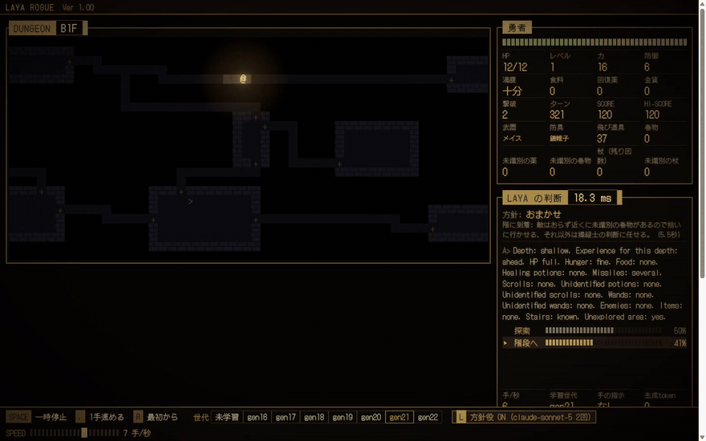

# laya-rogue

[Laya](https://github.com/NandhaKishorM/laya) にローグライクをプレイさせる個人の実験。メモは [NOTES.md](NOTES.md)。



きっかけは laya-mlx の [Snake デモ](https://mizchi-laya-web-demo.static.hf.space/snake.html)。ローカルで秒間 60 回判断できる小さな AI なら、何かゲームに使えるかもしれないと思った。

そこで Rogue を模したゲームを作り、素の Laya に盤面を読ませてみたが、ランダムより早く死んだ。Laya は文章の分類器で、状況を見て手を変えることができない。

改めて Snake デモのコードを読むと、プランナーが各方向に `Safe. Best route to food.` のような答えを書き、Laya はそれを読んで選んでいるだけの出来レースだった。

自己対戦で集めた経験で判断ヘッドだけを事後学習させると、人間が書いた if 文と同じくらいまで潜れるようになった。推論の速さは変わらない。

とはいえ Snake デモにも planner はあるし、[Minecraft のエンダードラゴン討伐](https://github.com/rmalde/minecraft-agent)も LLM が計画して Jev が即断する分業だった。そこで planner の位置に `claude -p` を置き、一手一手は Laya、全体方針は LLM という形にした。

方針役を付けても成績はまだ変わらない。ただ介入の理由が画面に出るので、見た目はいい感じになった。次に何をするかは未定。

## 遊び方

```
uv sync
uv run learn.py 16 1200
uv run train.py 16 gen21 30
uv run server.py          # http://127.0.0.1:8766/
uv run server.py --llm    # 方針役つき (Claude Code の claude -p を呼ぶので、ログイン済みの Claude Code が要る)
uv run server.py --difficulty original   # 難易度 normal / hard / original (画面からも切り替えられる)
uv run server.py --replay data/replays    # sim.py / learn.py の記録を再生 (ディレクトリなら最新の記録を追いかけ、回している対戦をそのまま見られる)
                                          # 画面: SPACE 一時停止、. 1 手、R 最初から、L 方針役、T テーマ (LAYA ROGUE / DOS 16 色 / CGA 4 色 / xterm 風)
uv run sim.py 16 8000 random rules diver table:16 laya:gen21
uv run sim.py 128 8000 rules diver --difficulty original
```

Python 3.12 / uv / CUDA 対応 GPU。

## Credits

Game rules and numeric tables (monster roster/stats, combat, experience, hunger) are modeled on
*Rogue: Exploring the Dungeons of Doom* 5.4.4 by Michael Toy, Ken Arnold and Glenn Wichman.
All code here is an independent Python implementation; no original source code is included.
This project is not affiliated with or endorsed by the original authors or any rights holder of the "Rogue" name.
See [THIRD_PARTY_NOTICES.md](THIRD_PARTY_NOTICES.md).

Laya 本体は Convai Innovations による Apache 2.0 のモデルで、このリポジトリには含まれない。

## ライセンス

MIT（`rogue_data.py` の数値表の出典については THIRD_PARTY_NOTICES.md）。
