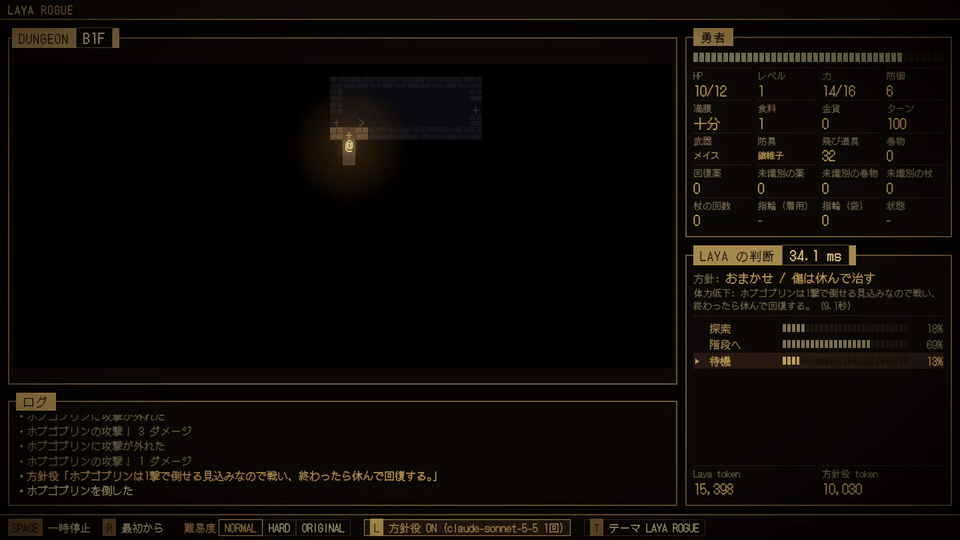

# laya-rogue

[Laya](https://github.com/NandhaKishorM/laya) にローグライクをプレイさせる個人の実験。



きっかけは laya-mlx の [Snake デモ](https://mizchi-laya-web-demo.static.hf.space/snake.html)。ローカルで秒間 60 回判断できる小さな AI なら、何かゲームに使えるかもしれないと思った。

そこで Rogue を模したゲームを作り、素の Laya に盤面を読ませてみたが、ランダムより早く死んだ。Laya は文章の分類器で、状況を見て手を変えることができない。

改めて Snake デモのコードを読むと、プランナーが各方向に `Safe. Best route to food.` のような答えを書き、Laya はそれを読んで選んでいるだけの出来レースだった。

自己対戦で集めた経験で判断ヘッドだけを事後学習させると、人間が書いた if 文と同じくらいまで潜れるようになった。推論の速さは変わらない。

とはいえ Snake デモにも planner はあるし、[Minecraft のエンダードラゴン討伐](https://github.com/rmalde/minecraft-agent)も LLM が計画して Jev が即断する分業だった。そこで planner の位置に `claude -p` を置き、一手一手は Laya、全体方針は LLM という形にした。

## 0.1.0 の時点 (2026-10-04)

本家 Rogue 5.4.4 準拠のゲームの学習用の難易度 NORMAL (本家の全要素入りは ORIGINAL) で、128 回の平均到達階:

| 頭脳 | 1 階から | 20 階 |
|---|---|---|
| ランダム | 約 2 | 0 |
| 人間が書いた簡単な if 文 | 7.75 | 0 |
| **Laya (自己対戦で学習した判断ヘッド 14.8M)** | **7.96** (最高 17) | 0 |
| 人間が書いた強い if 文 | 9.19 | 0 |

1 手 12 ms。強い if 文でも 20 階には届かないので、「まず 20 階」はこの環境では的にならなかった。

方針役 (Sonnet) は成績を上げない。付けると下がることが多く、いまは判断の理由を画面に出す実況の役。

観戦画面には、近くの敵ととどめを刺した敵の絵が出る。

## 遊び方

```
uv sync
uv run learn.py 16 1200
uv run train.py 16 gen26 60
uv run server.py          # http://127.0.0.1:8766/ 方針役つき (Claude Code の claude -p を呼ぶので、ログイン済みの Claude Code が要る)
uv run server.py --no-llm # 方針役なし
uv run server.py --difficulty original   # 難易度 normal / hard / original (画面からも切り替えられる)
uv run server.py --replay data/replays    # sim.py / learn.py の記録を再生 (ディレクトリなら最新の記録を追いかけ、回している対戦をそのまま見られる)
                                          # 画面: SPACE 一時停止、R 最初から、L 方針役、T テーマ (LAYA ROGUE / DOS 16 色 / CGA 4 色 / xterm 風)
uv run sim.py 16 8000 random rules diver table:16 laya:gen21
uv run sim.py 128 8000 rules diver --difficulty original
```

Python 3.12 / uv / CUDA 対応 GPU。

## Credits

Game rules and numeric tables (monster roster/stats, combat, experience, hunger) are modeled on
*Rogue: Exploring the Dungeons of Doom* 5.4.4 by Michael Toy, Ken Arnold and Glenn Wichman.
All code here is an independent Python implementation; no original source code is included.
This project is not affiliated with or endorsed by the original authors or any rights holder of the "Rogue" name.
See [THIRD_PARTY_NOTICES.md](THIRD_PARTY_NOTICES.md).

観戦画面のモンスターの絵 (`static/monsters/`) は とり夫 さんのフリー素材 ([pixiv](https://www.pixiv.net/users/5887541))。MIT の対象外。

Laya 本体は Convai Innovations による Apache 2.0 のモデルで、このリポジトリには含まれない。

## ライセンス

MIT（`rogue_data.py` の数値表の出典と、モンスターの絵については THIRD_PARTY_NOTICES.md）。
